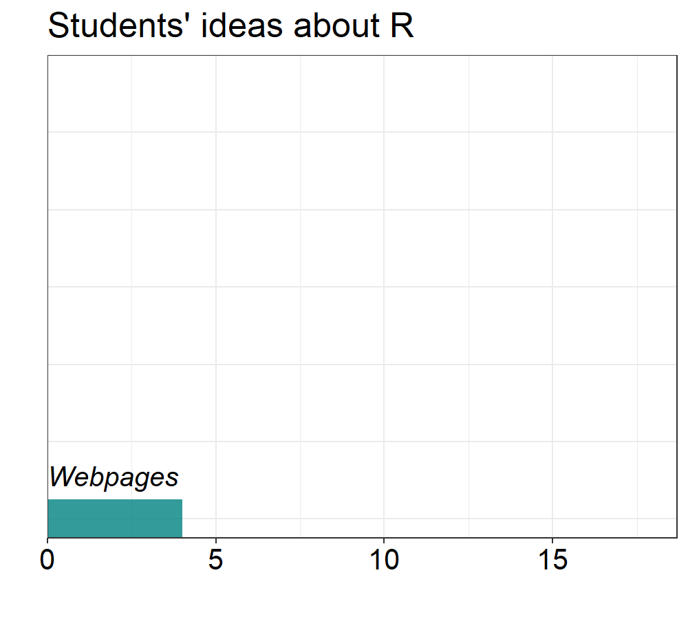

```{r setup, include=FALSE}
knitr::opts_chunk$set(dpi = 1200)
                      
library(ggplot2)
library(plotly)
library(tidyverse)
library(flexdashboard)
library(formr)
library(extrafont)
library(gganimate)
mytheme=theme_bw()+
  theme(axis.text=element_text(size=12, colour = "black"),
        legend.margin = margin(0,0,0,0,"pt"),
        title = element_text(size=16),
        axis.title = element_text(size=14, colour = "black"),
        strip.background = element_rect(colour = "black",fill = "white"))
df_all=read.csv("a2survey (1).csv")
head(df)
sex=c("1"="Male","2"="Female","3"="Other")
degree=c("1"="Master","2"="PhD")
school=c("1"="Env Science","2"="Env Enge","3"="Geography","4"="Statistics","5"="Other")
df_all$sex=plyr::revalue(as.factor(df_all$sex),replace =sex)
df_all$degree   =plyr::revalue(as.factor(df_all$degree),replace = degree)  
df_all$school  = plyr::revalue(as.factor(df_all$school),replace = school) #%>% 

fixing_results_data= function(x,objectives_groups) { 
  df_selected=filter(df_all,get(x)!="")
  obsectives=as.data.frame(matrix(do.call("rbind",strsplit(df_all[,x], split=', ', fixed=F)),ncol = length(objectives_groups),byrow = F))
  names(obsectives)=paste("Objectives",names(obsectives))
  objectives=bind_cols(df_selected,obsectives) %>% 
  select(session,sex,degree,school,tidyselect::vars_select(names(.),starts_with("Objectives ",ignore.case = T))) %>%
  gather(key,value,-c(1:4)) #%>%
objectives$value=plyr::revalue(x = as.factor(objectives$value),replace = objectives_groups)
selected_df=objectives %>% 
  group_by(session) %>% 
  distinct(value,.keep_all = T) %>% 
  ungroup()
}


```

PAGE 1
=======================================================================

Row
-----------------------------------------------------------------------

### Respondants

```{r,fig.width=9}

df1=df_all %>% 
      select(sex,school,degree) %>% 
    group_by(sex) %>% 
  gather(key,value="Category",-1) %>% 
  group_by(sex,key,Category) %>% 
  count() %>% 
    mutate(`Number of students`=ifelse(sex=="Male",n*(-1),n)) %>% 
    group_by(sex) %>% 
mutate(group=sum(`Number of students`))
    
plotly::ggplotly(ggplot(df1,aes(y=key,x=`Number of students`,fill=Category,text=paste0("Number of students: ",abs(`Number of students`))))+
  geom_col()+
  geom_vline(xintercept = 0,colour="black",size=2)+
  ggsci::scale_fill_jco(alpha = 0.8)+
  scale_y_discrete(limits=(c("degree","school")),expand = expansion(mult = c(0.5,.8)))+
  scale_x_continuous(breaks=seq(-50,50,5),labels=abs(seq(-50,50,5)))+
  annotate("text",x=c(-1.5,2.5),y=2.6,label=c("Male","Female"),size=5)+
  labs(x="",y="",title = "Students in Environmental Statistics")+
  mytheme+
  theme(legend.position = "bottom",
        plot.margin = margin(0,0,-2,0,"pt")),
tooltip = c("Category","text"))
```


###

```{r,eval=T}

df=df_all %>% 
  filter(sex!="Other")
p=ggplot(df,aes(y=importance,x=familiarity,colour=sex,shape=sex))+
  geom_point(size=7)+
  geom_smooth(method = "lm",se=F,show.legend = F)+
  ggpmisc::stat_poly_eq(aes(label = paste(stat(eq.label),stat(rr.label),stat(p.value.label), sep = "~~~")), vstep = 0.1,hjust=0, label.x.npc = 0.05, formula = "y~x", parse = TRUE, size = 4.5,label.y.npc = "top")+
  scale_color_manual(values=c("steelblue","tomato"))+
  scale_shape_manual(values=c("\u2642","\u2640"))+
  scale_y_continuous(expand = expansion(mult = c(0.15,0.5)),breaks = c(60,80,100),labels = scales::percent(x=c(60,80,100),scale = 1))+
  scale_x_continuous(breaks = seq(0,100,20),labels = scales::percent(x=seq(0,100,20),scale = 1))+
  labs(title = "Any trend?",x="Familiarity",y="Importance",colour="",shape="")+
  mytheme+
  theme(legend.position = c(0.8,0.9),legend.direction = "horizontal",legend.text = element_text(size=12,face = "bold"))
p
```

Row
-----------------------------------------------------------------------

### 

```{r,fig.width=8,fig.height=4}

objectives_groups=c("1"="Statistical methods that \nI can use for my articles","2"="Statistics in general","3"=	"Linear models","4"=	"ANOVAS","5"=	"Correlations plots","6"=	"Anything is fine","7"=	"Figures","8"="Hopefully something complex")

results=fixing_results_data(x = "objectives",objectives_groups = objectives_groups)

total=results %>% 
  count(value)
groups=results %>% 
  count(value,sex)

ggplot(total,aes(x=n,y=reorder(value,n)))+
  geom_col(aes(fill="Total"))+
  geom_col(data=groups,mapping = aes(fill=sex),position = position_dodge(preserve = "single"))+
  geom_text(data=groups,mapping = aes(label=n),vjust=ifelse(groups$sex=="Female",-0.4,1.2),hjust=1.5)+
  labs(x="Students",y="",fill=element_blank(),title = "Students Objectives")+
  scale_fill_manual(values = c("tomato","steelblue","grey80"))+
  mytheme +
  theme(legend.position = c(0.9,0.15),
        axis.text.y = element_text(size=15),
        axis.ticks.x = element_blank(),
        axis.text.x = element_blank(),
        panel.grid.major.x = element_blank(),   
        panel.grid.minor.x = element_blank(),
        legend.text = element_text(size=12,face = "bold"))

```

###

```{r}
library(ggimage)
objectives_groups=c("1"="SPSS","2"="Stata","3"=	"Minitab","4"="MATLAB","5"=	"Origin","6"=	"ArcGIS","7"=	"LaTeX","8"="Python","9"="R/R-studio")
images=data.frame(value=unique(objectives_groups),images=c("spss.png","stata.png","minitab.png","matlab.png","origin.png","arcgis.png","latex.png","python.png","r.png"))

results=fixing_results_data(x = "knowledge",objectives_groups = objectives_groups)

total=results %>% 
  count(value) %>% 
  left_join(.,images) %>% 
  ungroup()

ggplot(total,aes(y=n,x=reorder(value,n),image=images,label=n))+
  geom_col(aes(fill="total"))+
  labs(x="",y="",fill=element_blank(),title = "Favorite programs")+
  geom_image(position=position_nudge(y=0.8),size=0.09)+
  scale_y_continuous(expand=expansion(mult = c(0.05,0.2)))+
  geom_text(position = position_nudge(y=-0.5),size=6,colour="#edf6f9")+
  annotate("segment",x = "R/R-studio",xend="R/R-studio",yend=unlist(filter(total,value=="R/R-studio")[,2]+2),y=unlist(filter(total,value=="R/R-studio")[,2]+4),
           linetype=1,size=1.2,arrow=arrow(length = unit(10,"pt"),ends = "last",type = "closed"),colour="red")+
  scale_fill_manual(values = c("#457b9d"))+
  mytheme +
  theme(legend.position = "none",
        axis.text.y = element_blank(),
        axis.ticks.y = element_blank())
```

### 

```{r}
objectives_groups=c("1"="Excel","2"="OriginLab","3"=	"SPSS","4"="MATLAB","5"=	"Python","6"=	"ArcGIS","7"="R/R-studio")
images=data.frame(value=unique(objectives_groups),
                  images=c("excel.png","origin.png","spss.png",
                           "matlab.png","python.png","arcgis.png","r.png"))
results=fixing_results_data(x = "knowledge2",objectives_groups = objectives_groups)

total=results %>% 
  count(value) %>% 
  left_join(.,images)

ggplot(total,aes(y=n,x=reorder(value,n),image=images,label=n))+
  geom_col(aes(fill="total"))+
  labs(x="",y="",fill=element_blank(),title = "Favorite programs for plotting")+
  geom_image(position=position_nudge(y=1),size=0.09)+
  scale_y_continuous(expand=expansion(mult = c(0.05,0.2)))+
  geom_text(position = position_nudge(y=-0.5),size=6,colour="#003049")+
  annotate("segment",x = "R/R-studio",xend="R/R-studio",yend=unlist(filter(total,value=="R/R-studio")[,2]+2),y=unlist(filter(total,value=="R/R-studio")[,2]+5),linetype=1,size=1.2,arrow=arrow(length = unit(10,"pt"),ends = "last",type = "closed"),colour="#d62828")+
  scale_fill_manual(values = c("#eae2b7"))+
  mytheme +
  theme(legend.position = "none",
        axis.text.y = element_blank(),
        axis.ticks.y = element_blank())
```


PAGE 2
=======================================================================

Row
-----------------------------------------------------------------------

### 

```{r}
df=df_all %>% 
  filter(!is.na(school))

objectives_groups=c("1"="What is R !?!","2"="I dont like it","3"=	"I get too many errors","4"="I know something","5"=	"I write some code")

df$value=plyr::revalue(x = as.factor(df$experience),replace = objectives_groups)

total=df %>% 
  count(value) %>% 
  left_join(.,images)


ggplot(total,aes(area=n,fill=value,label=paste(value,"\n",n)))+
  treemapify::geom_treemap()+
  treemapify::geom_treemap_text(colour = "black",
                    place = "centre",
                    size = 15)+
                  scale_x_continuous(expand = c(0, 0)) +
                  scale_y_continuous(expand = c(0, 0)) +
                  scale_fill_manual(values = c("#006d77","#118ab2","#06d6a0","#e09f3e","#f07167"))+
  labs(title = "Students' Experience with R")+
  theme(legend.position = "none")
```

### 

```{r,eval=F,gganimate = list(nframes = 50, fps = 20)}
df=df_all %>% 
  filter(!experience2%in% c("","1","2","3","4","5","6"))


objectives_groups=c("1"="Some analysis and plots like the RDA","2"="A lot of statistics","3"=	"Plot amazing figures",
                    "4"="Write articles","5"=	"Webpages","6"="Apps")

results=fixing_results_data(x ="experience2",objectives_groups = objectives_groups)

total=results %>%
  count(value)
p=ggplot(total,aes(x=n,y=reorder(value,n),fill=value,label=value))+
  geom_col(width=0.5)+
  geom_text(aes(x=0),hjust=0,vjust=-1.6,fontface="italic",size=5)+
  scale_x_continuous(expand = expansion(mult = c(0,0.1)))+
  scale_y_discrete(expand = expansion(mult = c(0.05,0.2)))+
  ggsci::scale_fill_aaas(alpha = 0.8)+
  labs(title = "Students' ideas about R",y="",x="")+
  mytheme+
  theme(title = element_text(size=15),axis.text.x = element_text(size=15),
        axis.text.y = element_blank(),axis.ticks.y = element_blank(),legend.position = "none")+
  gganimate::transition_states(reorder(value,n))+
  gganimate::shadow_mark()+
  gganimate:: enter_fade()

gganimate::anim_save(animation = p,filename = "animation_stats2.gif",height=4.5,width=5,units="in",res=200)

```



Row
-----------------------------------------------------------------------

### 

```{r, echo=FALSE,out.width=100,out.height=50,fig.cap="Winners",fig.show='hold'}
objectives_groups=c("1"="Left","2"="Right","3"=	"Both","4"="None")
df=df_all %>%
  select(image_selection1,image_selection2,image_selection3) %>%
  gather() %>%
  count(value,key)

df$image_selection1=plyr::revalue(as.factor(df$value),objectives_groups)
df=df %>%
  filter(image_selection1%in%c("Left","Right"))
df$images=c("left1.png","left2.png","left3.png","right1.png","right2.png","right3.png")
winers=df %>%
group_by(key) %>%
slice_max(n = 1,order_by = n)
knitr::include_graphics(path = "left1.png")
```

###

```{r}
knitr::include_graphics(path = c(winers$images)[2])
```

### 

```{r}
knitr::include_graphics(path = c(winers$images)[3])
```


